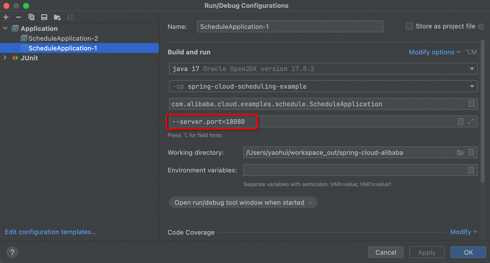

# Spring Cloud Alibaba Scheduling Example

## Project description

Spring Cloud Alibaba Scheduling provides a timing task scheduling capability based on Spring Scheduling, supporting distributed scenarios for timing task scheduling. It offers a quick integration solution for timing task scheduling services in distributed scenarios.

The current offering is based on the open-source ShedLock for distributed lock acquisition, along with Alibaba Cloud's SchedulerX service [quick start](https://sca.aliyun.com/en/docs/2023/user-guide/schedulerx/quick-start/), Subsequent releases will provide access to more open-source solutions implementations.

## Project dependencies

### Access `spring-cloud-starter-alibaba-schedulerx`

Add the following dependencies to the project `pom.xml`：

   ```xml
   <dependency>
        <groupId>com.alibaba.cloud</groupId>
        <artifactId>spring-cloud-starter-alibaba-schedulerx</artifactId>
   </dependency>
   ```

## Project config description

In the Example project, two types of integration configuration modes are provided for `shedlock` and `schedulerx`, Select the required access mode configuration file in `application.yaml`, the example defaults to the shedlock solution.

### Solution 1. Distributed shedlock integration configuration

Edit the following configuration to the `application-schedulerx.yml`:
   ```yaml
   spring:
      cloud:
         scheduling:
            # Distributed mode: shedlock, schedulerx
            # Set config value: shedlock
            distributed-mode: shedlock
      datasource:
         driver-class: com.mysql.cj.jdbc.Driver
         url: {jdbc_url}
         username: {jdbc.username}
         password: {jdbc.password}
   ```
You should replace `{jdbc_url}`,`{jdbc.username}`, and `{jdbc.password}` with your actual database connection information.

>️ Precautions：If there's no database instance can be used, please create a database instance first.

### Solution 2. Alibaba Cloud's SchedulerX integration configuration
Edit the following configuration to the `application-schedulerx.yml`:
   ```yaml
   spring:
      cloud:
         scheduling:
            # Distributed mode: shedlock, schedulerx
            # Set config value: schedulerx
            distributed-mode: schedulerx
            schedulerx:
               # This configuration is required, Please get it from aliyun schedulerx console
               endpoint: acm.aliyun.com
               namespace: aad167f6-xxxx-xxxx-xxxx-xxxxxxxxx
               groupId: xxxxx
               appKey: PZm1XXXXXXXXXXXX
               # Optional config, if you need to sync task to schedulerx
               # task-sync: true
               # region-id: public
               # aliyun-access-key: XXXXXXXXXXXX
               # aliyun-secret-key: XXXXXXXXXXXX
               # task-model-default: standalone
   ```
On Alibaba Cloud service, each account has be granted a free quota for schedulerx. For detailed instructions on how to configure and use cloud product integrations, please refer to the respective product documentation. Refer to: [SchedulerX Spring Task](https://www.alibabacloud.com/help/en/schedulerx/user-guide/spring-jobs)

## Start application

After completing the above selection and configuration, simply run the `ScheduleApplication` class in Example to start the application. The `SimpleJob` class in this example project includes two Spring scheduled tasks that run every minute. Upon starting, you can expect to see the following logs:

```text
2024-05-17T11:20:59.981+08:00  INFO 66613 --- [spring-cloud-alibaba-schedule-example] [ sca-schedule-4] c.a.c.examples.schedule.job.SimpleJob    : time=2024-05-17 11:20:59 do job1...
2024-05-17T11:20:59.985+08:00  INFO 66613 --- [spring-cloud-alibaba-schedule-example] [ sca-schedule-1] c.a.c.examples.schedule.job.SimpleJob    : time=2024-05-17 11:20:59 do job2...
```
### Distributed running verification

Create two application launch configurations in IDEA, each with the startup parameter `--server.port={port}` to start the corresponding application processes. The example project defaults to using `shedlock`, 
We can observe that `job1` will be triggered by both applications, whereas `job2` which has been annotated with `@SchedulerLock` will only be triggered in one application at the same time.


- ScheduleApplication-1, startup parameter: `--server.port=18080`, application logs：
```text
2024-05-20T14:02:00.003+08:00  INFO 80520 --- [spring-cloud-alibaba-schedule-example] [ sca-schedule-4] c.a.c.examples.schedule.job.SimpleJob    : time=2024-05-20 14:02:00 do job1...
2024-05-20T14:03:00.008+08:00  INFO 80520 --- [spring-cloud-alibaba-schedule-example] [ sca-schedule-4] c.a.c.examples.schedule.job.SimpleJob    : time=2024-05-20 14:03:00 do job1...
2024-05-20T14:03:00.008+08:00  INFO 80520 --- [spring-cloud-alibaba-schedule-example] [ sca-schedule-1] c.a.c.examples.schedule.job.SimpleJob    : time=2024-05-20 14:03:00 do job2...
2024-05-20T14:04:00.006+08:00  INFO 80520 --- [spring-cloud-alibaba-schedule-example] [ sca-schedule-3] c.a.c.examples.schedule.job.SimpleJob    : time=2024-05-20 14:04:00 do job1...
2024-05-20T14:04:00.010+08:00  INFO 80520 --- [spring-cloud-alibaba-schedule-example] [ sca-schedule-2] c.a.c.examples.schedule.job.SimpleJob    : time=2024-05-20 14:04:00 do job2...
2024-05-20T14:05:00.003+08:00  INFO 80520 --- [spring-cloud-alibaba-schedule-example] [ sca-schedule-5] c.a.c.examples.schedule.job.SimpleJob    : time=2024-05-20 14:05:00 do job1...
```
- ScheduleApplication-2, startup parameter: `--server.port=18081`, application logs：
```text
2024-05-20T14:02:00.003+08:00  INFO 80596 --- [spring-cloud-alibaba-schedule-example] [ sca-schedule-4] c.a.c.examples.schedule.job.SimpleJob    : time=2024-05-20 14:02:00 do job1...
2024-05-20T14:02:00.008+08:00  INFO 80596 --- [spring-cloud-alibaba-schedule-example] [ sca-schedule-3] c.a.c.examples.schedule.job.SimpleJob    : time=2024-05-20 14:02:00 do job2...
2024-05-20T14:03:00.004+08:00  INFO 80596 --- [spring-cloud-alibaba-schedule-example] [ sca-schedule-5] c.a.c.examples.schedule.job.SimpleJob    : time=2024-05-20 14:03:00 do job1...
2024-05-20T14:04:00.006+08:00  INFO 80596 --- [spring-cloud-alibaba-schedule-example] [ sca-schedule-3] c.a.c.examples.schedule.job.SimpleJob    : time=2024-05-20 14:04:00 do job1...
2024-05-20T14:05:00.004+08:00  INFO 80596 --- [spring-cloud-alibaba-schedule-example] [ sca-schedule-2] c.a.c.examples.schedule.job.SimpleJob    : time=2024-05-20 14:05:00 do job1...
2024-05-20T14:05:00.007+08:00  INFO 80596 --- [spring-cloud-alibaba-schedule-example] [ sca-schedule-4] c.a.c.examples.schedule.job.SimpleJob    : time=2024-05-20 14:05:00 do job2...
```
